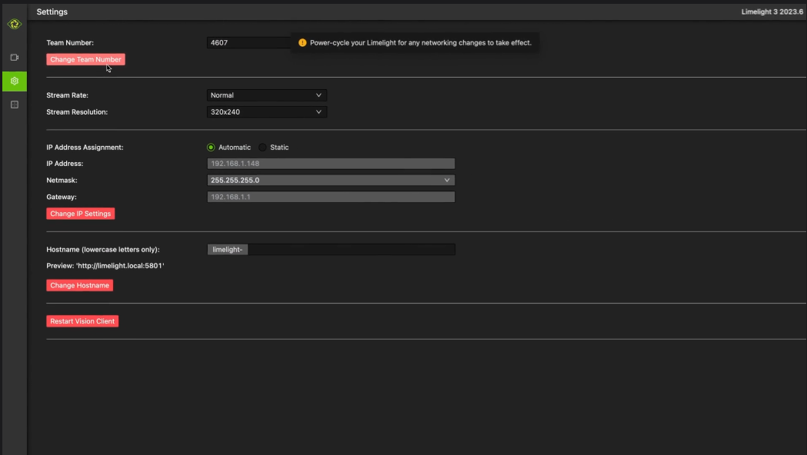
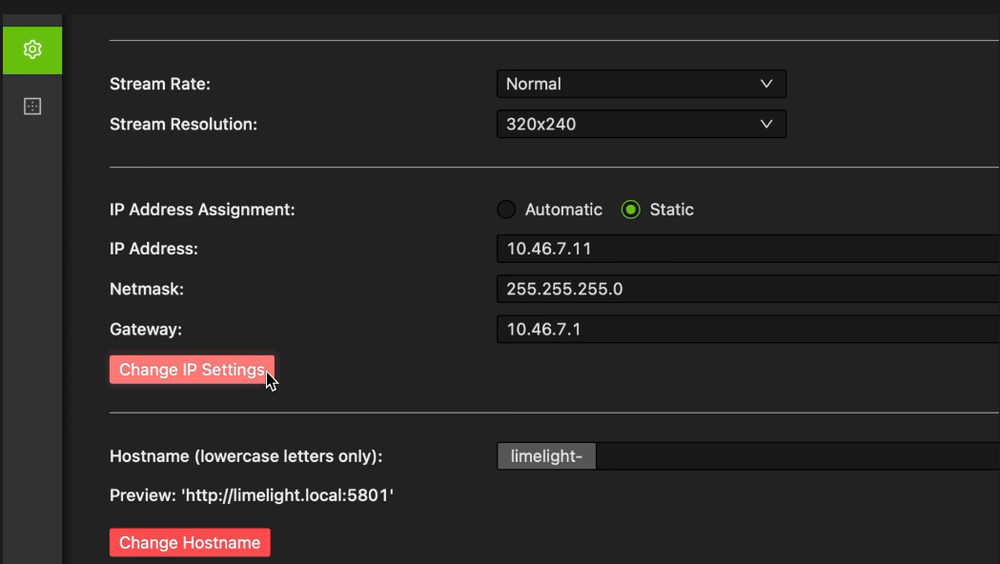

# Steps to Impliment AprilTag Tracking and Locilization using a Limelight

#### Mainly followed [Limelight Docs](https://docs.limelightvision.io/docs/docs-limelight/getting-started/summary) and [Steel Boot Robotics Docs](https://docs.steelbootrobotics.org/docs/Documents/limelight%20stuff.pdf#section.1.3)

#### Links in this document have been last updated on July 20, 2024

## What You Need
- Windows 10+ computer
- Internet Connection (if downloading images and tools)
## Wiring
### Wiring (PoE)
#### This is only if we have a [Passive PoE Injector](https://www.revrobotics.com/rev-11-1210/).
1. (Limelight 1 only) Ensure that your Limelight’s power jumper is set to the “E” position.
2. Connect the Passive PoE Injector to the PDP (NOT the VRM)
3. Add any breaker (5A, 10A, 20A, etc.) to the same slot on the PDP.
4. Run an ethernet cable from your Limelight to your passive POE injector.

### Wiring (No PoE)
1. Run two wires from the limelight to a slot on your PDP (NOT the VRM)
2. Add any breaker (5A, 10A, 20A, etc.) to the same slot on the PDP.
3. Run an ethernet cable from your Limelight to your robot radio.

## Getting Ready to Interface
### Must be on Windows
1. Download the latest [USB drivers](https://github.com/raspberrypi/usbboot/raw/master/win32/rpiboot_setup.exe) (needed to access the Limelight through USB)
2. Download [Balena Etcher](https://github.com/balena-io/etcher/releases/download/v1.19.5/balenaEtcher-1.19.5.Setup.exe) (needed to write a new image onto the Limelight)
3. Download the correct image for the Limelight ([1/2/2+](https://downloads.limelightvision.io/images/limelight2_2024_9_1.zip), [3](https://downloads.limelightvision.io/images/limelight3_2024_9_1.zip), [3G](https://downloads.limelightvision.io/images/limelight3g_2024_9_1.zip))
4. Download [Limelight Hardware Manager](https://downloads.limelightvision.io/software/LimelightHardwareManagerSetup1_4_0.exe) (allows you to see connected Limelights)
5. Download [Bonjour](https://support.apple.com/downloads/DL999/en_US/BonjourPSSetup.exe) (Allows for correct transmition of the network). **Instuctions: Go to Add or Remove Programs. Search "Bonjour. If none are shown, download Bonjour. If two are shown, uninstall “Bonjour Print Services”.**

### Restart the Computer after downloading everything.

## Updating Limelight OS
### Limelight 3G
1. Power off your Limelight.
2. Run Balena Etcher as an admin.
3. Hold the config button on your Limelight, and while holding, run a USB->USB-C cable from your laptop to your limelight. Your limelight will power on automatically. (**Only connect the USB-C cable while imaging. Limelight enters a special flash mode while the microUSB cable is connected. You will not be able to access the web interface while Limelight is in flash mode.**)
4. Wait about 20 seconds for your machine to recognize the Limelight.
5. Select the correct image for your Limelight in Balena Etcher.
6. Select a “Compute Module” device in the “Drives” menu.
7. Click “Flash”.
8. Once flashing is complete, remove the usb cable from your limelight.
### Limelight 3
1. Power off your Limelight.
2. Run Balena Etcher as an admin.
3. Run a USB->USB-C cable from your laptop to your Limelight. The Limelight will power on automatically. (**Only connect the USB-C cable while imaging. Limelight enters a special flash mode while the microUSB cable is connected. You will not be able to access the web interface while Limelight is in flash mode.**)
4. Wait about 20 seconds for your machine to recognize the Limelight.
5. Select the correct image for your Limelight in Balena Etcher.
6. Select a “Compute Module” device in the “Drives” menu.
7. Click “Flash”.
8. Once flashing is complete, remove the usb cable from your limelight.
### Limelight 2/2+
1. Power off your Limelight.
2. Run Balena Etcher as an admin.
3. Run a USB->MicroUSB cable from your laptop to the Limelight. The Limelight will power on automatically.
4. Wait about 20 seconds for your machine to recognize the Limelight.
5. Select the correct image for your Limelight in Balena Etcher.
6. Select a “Compute Module” device in the “Drives” menu.
7. Click “Flash”.
8. Once flashing is complete, remove the usb cable from your limelight.

### Limelight 1
#### Some versions of Limelight 1 are electrostatically sensitive around the micro-usb port. To prevent damaging the port, ground yourself to something metal before you connect to the micro usb port. This will ensure your personal static charge has been discharged.
1. Power off your Limelight.
2. Run Balena Etcher as an admin.
3. Run a USB-MicroUSB cable from your laptop to the Limelight.
4. Turn-on to the Limelight.
4. Wait about 20 seconds for your machine to recognize the Limelight.
5. Select the correct image for your Limelight in Balena Etcher.
6. Select a “Compute Module” device in the “Drives” menu.
7. Click “Flash”.
8. Once flashing is complete, remove the usb cable from your limelight.

## Static IP Setup
#### Configuring an static IP address is useful during competitions for reliability.
### Set Team Number
1. Power-up your robot, and connect your laptop to your robot’s network.
2. After your Limelight flashes its LED array, open the Limelight Hardware Manager and search for your Limelight or navigate to http://limelight.local:5801. This is the configuration panel.
3. Navigate to the "Settings" tab on the left side of the interface.
4. Enter your team number and press the "Change Team Number” button.

### Set IP Address
1. Change your “IP Assignment” to “Static”.
2. Set your Limelight’s IP address to “10.TE.AM.11”.
7. Set the Netmask to “255.255.255.0”.
8. Set the Gateway to “10.TE.AM.1”.
9. Click the "Change IP Settings" button.
10. NOTE: Teams with zeros need to pay special attention: Team 916 uses "10.9.16.xx", Team 9106 uses "10.91.6.xx", Team 9016 uses "10.90.16.xx".
11. Power-cycle your robot.
12. You will now be access your config panel at 10.TE.AM.11:5801, and your camera stream at 10.TE.AM.11:5800

## Stuff To Do Next
1. [Set Cam Pose](https://docs.limelightvision.io/docs/docs-limelight/pipeline-apriltag/apriltag-robot-localization#configuring-your-limelights-robot-space-pose)
2. [ChArUco Calibration](https://docs.limelightvision.io/docs/docs-limelight/performing-charuco-camera-calibration)
3. [Before/At Comp](https://docs.limelightvision.io/docs/docs-limelight/getting-started/best-practices)

## Status Lights
### Green Status Light
- The green status light will blink slowly if no targets are detected by the current pipeline. It will blink quickly if any targets are detected by the current pipeline.
### Yellow Status Light
- The yellow status light will blink when a static IP address has not been assigned. If a static IP address is assigned, the light will remain either consistently on or off, without any blinking.
### Green Illumination LEDs
#### The green illumination LEDs on Limelight 1, 2, and 3 are controllable via the web interface and various APIs, but there are a few special blink patterns that are designed to help troubleshoot hardware and software issues:
- Left/Right or Top/Bottom alternating blink: The internal camera cable has become unseated, or the image sensor has suffered damage.
- Fast Blink (all leds): The networking reset button has been held for at least 10 seconds.
- Repeated Startup Sequence (three blinks, or multiple fade-in fade-out blinks): The software is crashing, possibly due to hardware damage.